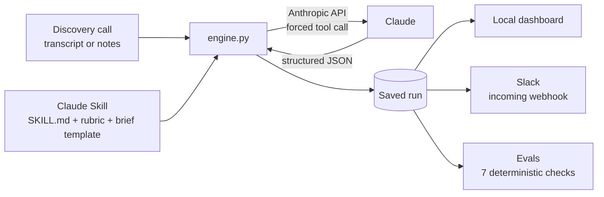

# Discovery to Spec

**Turn a customer discovery call into a product brief and a ready-to-build AI skill, in about a minute.**

Paste a call transcript or raw notes. Claude, running a custom skill, maps the customer's current
workflows, ranks the gaps by impact and effort, writes a product brief, and drafts a `SKILL.md` for
the top automation opportunity. Every conclusion is backed by a word-for-word customer quote, and the
finished brief can be sent to Slack in one click.

**Watch the 2-minute demo:** https://www.loom.com/share/5ce0f681ca184281bce1251e44b5cc95

> All sample calls in this repo are synthetic. No real customer data is used.

---

## Why I built it

At ServiceNow I supported AI adoption for 80+ enterprise accounts across the U.S. and Latin America.
After every discovery call someone had to turn pages of notes into a clear plan: what the customer
does today, what hurts, what to build first and how to measure it. That step took hours, and the
quality depended on who wrote it.

Discovery to Spec makes that step fast and consistent, and it keeps the output honest. If the model
can't point to what the customer actually said, it doesn't get to claim it.

## What you get from one call

| Output | What it contains |
|---|---|
| **Account snapshot** | Company, industry, size, stakeholders and their stance (decision maker, champion, skeptic) |
| **Current workflows** | What happens today, who does it, which tools, where it hurts, with a quote for each |
| **Gaps and opportunities** | 3 to 7 gaps scored on impact (1 to 5) and effort (1 to 5), ranked by priority, each with evidence |
| **Impact vs effort chart** | Quick wins, big bets, fill-ins and "later" at a glance |
| **Account health** | 0 to 100 score with the drivers behind it (urgency, budget, sponsorship, risk) |
| **Product brief** | Problem, goals, users, in scope, out of scope, success metrics, risks, open questions |
| **AI skill spec** | Inputs, steps, outputs, guardrails, integrations, plus a complete `SKILL.md` to download |
| **Slack post** | The brief summarized in a channel so the team can pick it up |

## How it works



1. **The skill is the product.** `skill/discovery-to-spec/` follows the Agent Skills format: a
   `SKILL.md` with the instructions and principles (stay grounded, separate facts from inferences,
   think like a PM), a prioritization rubric that defines what impact 5 or effort 2 means, and a brief
   template. The same folder works on its own in Claude or Claude Code.
2. **Structured output, not free text.** `engine.py` loads the skill as the system prompt and forces
   Claude to answer through a tool with a strict JSON schema. That makes the result reliable enough
   for a dashboard, an integration and automated tests.
3. **Priority is computed, not guessed.** Claude scores impact and effort using the rubric, and the
   code ranks gaps by `impact x (6 - effort)`, so low-effort, high-impact work rises to the top.
4. **The dashboard** (`app.py` + `static/`) is a small local Flask app: account list, full report,
   impact vs effort chart, brief, skill spec with copy and download, and the eval history.
5. **Slack** (`slack.py`) posts a formatted brief through an Incoming Webhook.

## Evals: how I know it works

`evals/run_evals.py` runs the skill against five synthetic discovery calls (a paid media agency, an
e-commerce brand, a logistics provider, a credit union IT desk and an online learning company) and
scores each result on seven checks. The checks are plain code, so they cost nothing extra to run and
give the same answer every time.

| Check | What it verifies |
|---|---|
| Schema complete | Every section of the output exists |
| Account identified | The right company was recognized |
| Quotes grounded | Every evidence quote appears word for word in the transcript |
| 3 to 7 gaps | Focused, not a laundry list |
| Key topics covered | The main pains a PM should catch are present |
| Top priority matches customer | The #1 ranked gap is what the customer said to fix first |
| Valid SKILL.md | The generated skill has valid `name` and `description` frontmatter |

**First live run (skill v1.0, claude-sonnet-5): 34 of 35 checks passed (97%).** The one failure was a
grounding check: Claude slightly reworded one customer quote instead of copying it exactly. That is
exactly the kind of error the evals exist to catch, and the next version of the skill tightens the
quoting rule. Results appear on the dashboard's Evals page with a history of every run, so skill
versions can be compared side by side.

## Tech stack

- **Python** with **Flask** for the local app and API
- **Anthropic API** (Claude) with tool use for structured output
- **Agent Skills** format for the reusable instructions
- **Slack Incoming Webhooks** for delivery
- Plain **HTML, CSS and JavaScript** for the dashboard (no framework), with an inline SVG chart
- Built and run in **VS Code**

## Project structure

```
discovery-to-spec/
├── app.py                  Local web app and API routes
├── engine.py               Loads the skill, calls Claude, enforces the JSON schema, saves runs
├── slack.py                Formats and posts the brief to Slack
├── skill/discovery-to-spec/
│   ├── SKILL.md            The skill: principles, steps, output rules
│   └── references/         Prioritization rubric and product brief template
├── evals/
│   ├── transcripts/        Five synthetic discovery calls
│   ├── cases.json          What a good answer must contain for each call
│   └── run_evals.py        Runs the skill and scores it
├── static/                 Dashboard (HTML, CSS, JS)
├── data/mock_output.json   Fixed example used when no API key is set
└── DESIGN.md               Visual design decisions for the dashboard
```

## Run it yourself

You need Python 3.9+ and an Anthropic API key from https://console.anthropic.com.

**Windows (PowerShell)**

```powershell
git clone <this repo URL>
cd discovery-to-spec
py -m venv .venv
.venv\Scripts\activate
pip install -r requirements.txt
copy .env.example .env
```

**Mac / Linux**

```bash
git clone <this repo URL>
cd discovery-to-spec
python3 -m venv .venv
source .venv/bin/activate
pip install -r requirements.txt
cp .env.example .env
```

Open `.env` and add your `ANTHROPIC_API_KEY` (and optionally a `SLACK_WEBHOOK_URL`). Then:

```bash
python evals/run_evals.py   # analyzes the 5 sample calls and scores them
python app.py               # open http://localhost:5050
```

Without an API key the app runs in **mock mode** and returns one fixed, clearly labeled example, so
you can explore the interface for free.

## What I'd build next

- Tighten the quoting rule (skill v1.1) and track the grounding score across versions
- Connect a CRM so briefs land on the account record, not only in Slack
- Accept audio: transcribe the call and run the skill in one step
- A second eval layer where a model grades brief quality against a rubric, next to the code checks

---

Built by **Javier Monestel** · [LinkedIn](https://www.linkedin.com/in/javier-monestel/)
